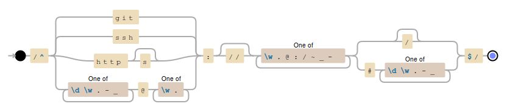

# git-clone-able [](http://badge.fury.io/js/git-clone-able)  [](https://travis-ci.org/jonschlinkert/git-clone-able)

> Regex to validate that a URL is a clone able git url.

This is a fork of [is-git-url](https://github.com/jonschlinkert/is-git-url) that tries to accept _any_ URLs that are clone able by git. See [is-git-url#9](https://github.com/jonschlinkert/is-git-url/pull/9).

## Install

Install with [npm](https://www.npmjs.com/)

```sh
$ npm i git-clone-able --save
```

## Usage

```js
var gitCloneAble = require('git-clone-able');

gitCloneAble('https://github.com/kasbah/git-clone-able');
//=> true

gitCloneAble('https://github.com:kasbah/git-clone-able');
//=> false
```

[Debuggex](https://www.debuggex.com) can be quite helpful if you want to amend and understand the regex.

[](https://www.debuggex.com)

## Related

* [is-git-url](https://github.com/jonschlinkert/is-git-url): The project this is forked from. It has stricter rules and will reject some URLs that _are_ clone able. 
* [git-repo-name](https://github.com/jonschlinkert/git-repo-name): Get the repository name from the git remote origin URL.
* [git-username](https://github.com/jonschlinkert/git-username): Get the username from a git remote origin URL.
* [github-contributors](https://github.com/jonschlinkert/github-contributors): Generate a markdown or JSON list of contributors for a project using the GitHub API.
* [git-branch](https://github.com/jonschlinkert/git-branch): Get the current branch for a local git repository.
* [parse-github-url](https://github.com/jonschlinkert/parse-github-url): Parse a github URL into an object.

## Running tests

Install dev dependencies:

```sh
$ npm i -d && npm test
```

## Contributing

Pull requests and stars are always welcome. For bugs and feature requests, [please create an issue](https://github.com/jonschlinkert/git-clone-able/issues/new)

## Original Author of is-git-url

**Jon Schlinkert**

+ [github/jonschlinkert](https://github.com/jonschlinkert)
+ [twitter/jonschlinkert](http://twitter.com/jonschlinkert)

## License

Copyright © 2015 Jon Schlinkert
Released under the MIT license.

***

_This file was generated by [verb-cli](https://github.com/assemble/verb-cli) on July 20, 2015._
